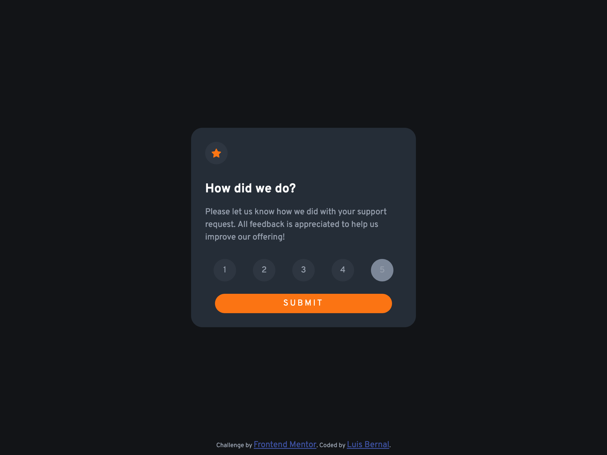

# Frontend Mentor - Interactive rating component solution

This is a solution to the [Interactive rating component challenge on Frontend Mentor](https://www.frontendmentor.io/challenges/interactive-rating-component-koxpeBUmI). Frontend Mentor challenges help you improve your coding skills by building realistic projects.

## Table of contents

- [Overview](#overview)
  - [The challenge](#the-challenge)
  - [Screenshot](#screenshot)
  - [Links](#links)
- [My process](#my-process)
  - [Built with](#built-with)
  - [What I learned](#what-i-learned)
  - [Continued development](#continued-development)

**Note: Delete this note and update the table of contents based on what sections you keep.**

## Overview

### The challenge

Users should be able to:

- View the optimal layout for the app depending on their device's screen size
- See hover states for all interactive elements on the page
- Select and submit a number rating
- See the "Thank you" card state after submitting a rating

### Screenshot

### Links

- Solution URL: [https://github.com/FrontendMentor-Lecap/Interactive-rating-component]
- Live Site URL: [https://frontendmentor-lecap.github.io/Interactive-rating-component/]

## My process

### Built with

- Semantic HTML5 markup
- CSS custom properties
- Flexbox
- CSS Grid
- Mobile-first workflow
- Basic JS.

### What I learned

I learned about DOM modification and about the use of radio buttons with a constant name. This project can be completed by using `<form>`but I just used 5 radio buttons with the same name, representing each marking. Based on the information recolected I used a submit button and the `onclick` event to get start a formula created in a script inside the same HTML file.

The formula had to perform 3 actions:

1. Query the radioBtns and selected answer.
2. Return the selected answer to a new variable.
3. Change the display between the question and the answer.

I know this formula might be long for what it is used, and perhaps I can clean it a lot, but it worked for me.

Lastly, the formula returns the value that the user selected, and it is shown in a `` inside the paragraph in the answer section.

### Continued development

I need to continue working on my basic JS and manipulating the DOM with different inputs and outputs. Also I have to improve my HTML coding in order to have a better syntaxis and semantics.
